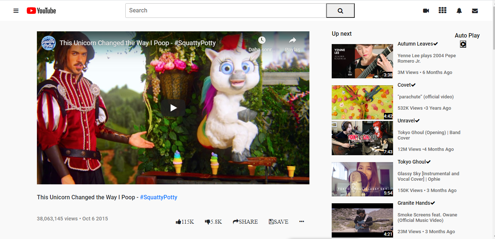

# YOUTUBE CLONE
________________________________________
## Buit with
____________________________________________________
### HTML
____________________________________________________
1-) We used a little bit Bootstrap.
2-) We added grid and flexbox.
3-) Project has different user comments.
### &
### CSS
____________________________________________________
4-) The page has almost the same background-color as Youtube.
5-) Aside bar has video duration. We added relatively to right under image and positioned.
6-) Aside bar uses 30% of page with flex. Other parts use 60% of the page. There is 10% space between 2 sides (left,right)

## Authors 
____________________________________________________
#### Muhammed Cihad Kurel
Github: [I'm an inline-style link](@mcihadkurel)
____________________________________________________
#### Nikolas Escobal
Github: [I'm an inline-style link](@nikoescobal)
____________________________________________________

